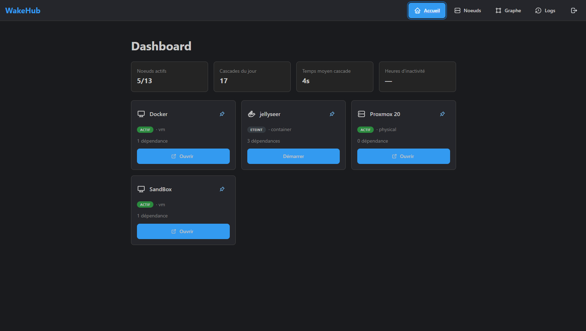
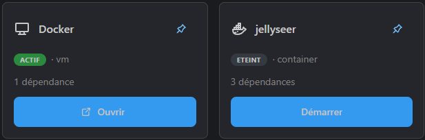
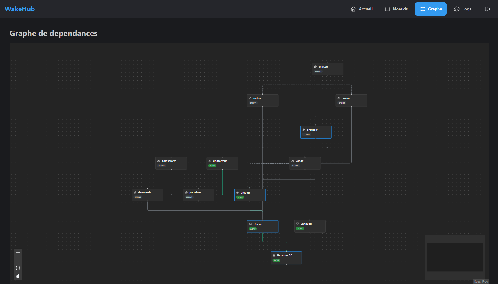
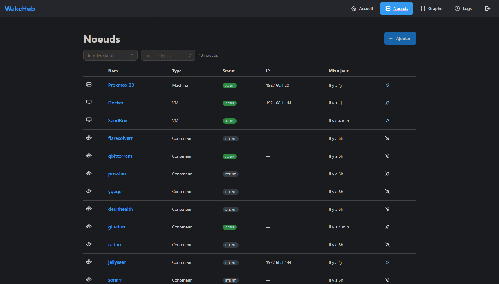
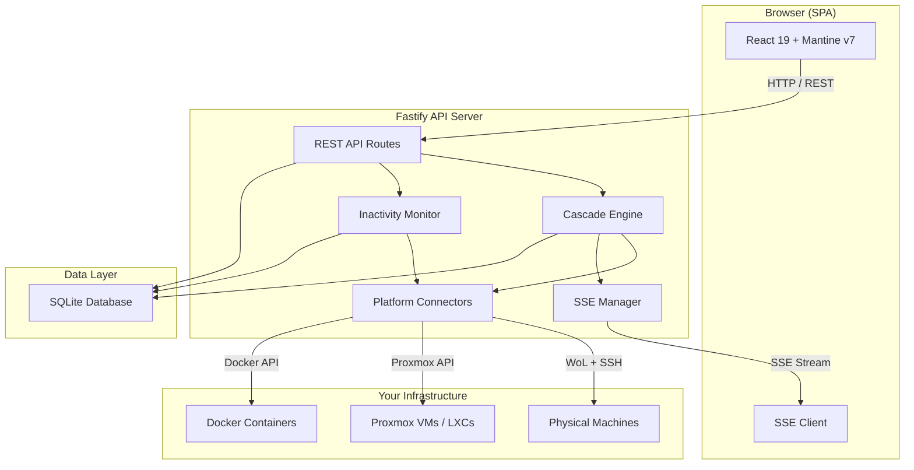

# WakeHub

**Intelligent power management for your homelab.** Start services on demand, shut them down when idle, and let WakeHub handle the dependency chains.

WakeHub solves a fundamental homelab problem: servers running 24/7 despite being used only a few hours a day. It orchestrates Wake-on-LAN, SSH, Proxmox, and Docker to bring your infrastructure up and down intelligently — respecting dependencies, protecting shared resources, and monitoring inactivity.

<!-- Screenshots — replace with actual images after deployment -->


## Table of Contents

- [Features](#features)
- [Architecture](#architecture)
- [Getting Started](#getting-started)
  - [Prerequisites](#prerequisites)
  - [Docker Deployment](#docker-deployment)
  - [Development Setup](#development-setup)
- [Configuration](#configuration)
- [Usage](#usage)
- [Tech Stack](#tech-stack)
- [Project Structure](#project-structure)
- [Testing](#testing)
- [Contributing](#contributing)
- [License](#license)

## Features

- **One-click service startup** — Click a service tile and WakeHub wakes every machine in the dependency chain, from bare metal to container
- **Automatic inactivity shutdown** — Monitor network traffic, CPU, RAM, and HTTP endpoints; shut down idle services after a configurable delay
- **Two-layer orchestration engine** — Respects both the physical hosting tree (parent/child) and functional dependencies (cross-layer, shared resources)
- **Multi-platform support** — Physical machines (WoL + SSH), Proxmox VMs/LXCs (API), Docker containers (direct or SSH tunnel)
- **Auto-discovery** — Automatically detect VMs, LXCs, and containers from Proxmox and Docker hosts
- **Real-time dashboard** — Live status updates via Server-Sent Events (SSE), pinnable service tiles, cascade progress indicators
- **Dependency graph visualization** — Interactive graph showing both structural and functional relationships
- **Shared dependency protection** — Never shuts down a resource still needed by another active service
- **Complete operation logging** — Every start, stop, and decision is logged with reasons, filterable and searchable
- **Secure by default** — Argon2id password hashing, AES-256-GCM credential encryption, HTTP-only session cookies

<!-- Screenshots — replace with actual images -->
| Dashboard | Dependency Graph | Node Management |
|:---------:|:----------------:|:---------------:|
|  |  |  |

## Architecture



WakeHub uses a **two-layer orchestration model**:

1. **Hosting tree** (structural) — Physical machines host VMs, which host containers. Starting a container means its host VM and physical machine must be up first.
2. **Functional dependencies** (logical) — A media server depends on a NAS for storage, regardless of where each runs. WakeHub resolves both layers into a single startup/shutdown sequence.

## Getting Started

### Prerequisites

- **Docker** and **Docker Compose** (recommended for production)
- **Node.js** >= 20.19.0 (for development)
- Network access to your infrastructure (WoL broadcast, SSH, Proxmox/Docker APIs)

### Docker Deployment

1. Clone the repository:

```bash
git clone https://github.com/DrunkRain/WakeHub.git
cd WakeHub
```

2. Generate secrets and start the service:

```bash
# Generate required secrets
export ENCRYPTION_KEY=$(openssl rand -hex 32)
export SESSION_SECRET=$(openssl rand -hex 32)

# Start WakeHub
docker compose up -d
```

3. Open `http://your-server:3000` in your browser. The first-time setup wizard creates your admin account.

### Development Setup

```bash
# Clone and install dependencies
git clone https://github.com/DrunkRain/WakeHub.git
cd WakeHub
npm install

# Configure environment
cp .env.example .env
# Edit .env — generate ENCRYPTION_KEY and SESSION_SECRET:
#   openssl rand -hex 32

# Start both frontend and backend in dev mode
npm run dev
```

The frontend runs at `http://localhost:5173` (Vite HMR) and the backend at `http://localhost:3000` (API + Swagger UI at `/docs`).

## Configuration

Create a `.env` file from the provided template:

| Variable | Description | Default |
|----------|-------------|---------|
| `PORT` | Server listening port | `3000` |
| `NODE_ENV` | `development` or `production` | `development` |
| `DATABASE_PATH` | SQLite database file path | `./data/wakehub.sqlite` |
| `ENCRYPTION_KEY` | AES-256-GCM key for credential encryption (32 bytes hex) | *required* |
| `SESSION_SECRET` | Session signing secret (32 bytes hex) | *required* |
| `COOKIE_SECURE` | Secure cookie flag (`true`, `false`, or `auto`) | `auto` |
| `CORS_ORIGIN` | Allowed CORS origin | `http://localhost:5173` |

Generate secrets with:

```bash
openssl rand -hex 32
```

## Usage

### 1. Add Your Infrastructure

Navigate to the **Nodes** page and add your physical machines manually (IP, MAC address, SSH credentials). For Proxmox and Docker hosts, configure API access and WakeHub auto-discovers all VMs, LXCs, and containers.

### 2. Define Dependencies

Use the **Dependency Graph** page to link services to their dependencies. Example: link your Jellyfin container to your NAS — WakeHub ensures the NAS is up before starting Jellyfin.

### 3. Pin Services to the Dashboard

Pin your most-used services for one-click access. Each tile shows real-time status and provides Start/Stop controls that cascade through the entire dependency chain.

### 4. Configure Inactivity Rules

Set per-service inactivity thresholds (network traffic delta, CPU/RAM usage, HTTP checks). WakeHub automatically shuts down idle services while protecting shared dependencies.

## Tech Stack

| Layer | Technology |
|-------|-----------|
| **Frontend** | React 19, TypeScript, Mantine v7, TanStack Query, Zustand, XYFlow, Vite |
| **Backend** | Fastify 5, TypeScript, Drizzle ORM, SQLite, Pino |
| **Real-time** | Server-Sent Events (SSE) |
| **Auth** | Argon2id, AES-256-GCM, HTTP-only cookies |
| **Infra connectors** | Wake-on-LAN, SSH (node-ssh), Proxmox API, Docker API |
| **Testing** | Vitest, React Testing Library |
| **Deployment** | Docker (multi-stage Alpine), Docker Compose |

## Project Structure

```
WakeHub/
├── apps/
│   ├── web/                    # React SPA (Vite)
│   │   └── src/
│   │       ├── features/       # Feature modules (auth, dashboard, nodes, graph, logs)
│   │       ├── api/            # HTTP client layer
│   │       ├── hooks/          # Custom hooks (SSE, etc.)
│   │       ├── stores/         # Zustand state
│   │       ├── components/     # Shared UI components
│   │       └── theme/          # Mantine theme config
│   └── server/                 # Fastify API
│       └── src/
│           ├── routes/         # REST endpoints
│           ├── services/       # Business logic (cascade engine, dependency graph)
│           ├── connectors/     # Platform integrations (WoL, Proxmox, Docker)
│           ├── sse/            # Real-time event broadcasting
│           ├── db/             # Drizzle schema & migrations
│           ├── middleware/     # Auth middleware
│           └── utils/          # Crypto, logging, errors
├── packages/
│   └── shared/                 # Shared TypeScript types & API contracts
├── docker/
│   └── Dockerfile              # Multi-stage production build
├── docker-compose.yml
└── .env.example
```

## Testing

```bash
# Run all tests
npm test

# Frontend tests only
npm test -w apps/web

# Backend tests only
npm test -w apps/server

# Type checking
cd apps/web && npx tsc --noEmit
cd apps/server && npx tsc --noEmit
```

## Contributing

Contributions are welcome! To get started:

1. Fork the repository
2. Create a feature branch (`git checkout -b feature/my-feature`)
3. Make your changes and add tests
4. Run the test suite (`npm test`) and linter (`npm run lint`)
5. Commit and push to your branch
6. Open a Pull Request

## License

This project is licensed under the **GPL-3.0 License**. See the [LICENSE](LICENSE) file for details.

---

Built for the homelab community. Stop wasting electricity, start managing power intelligently.
