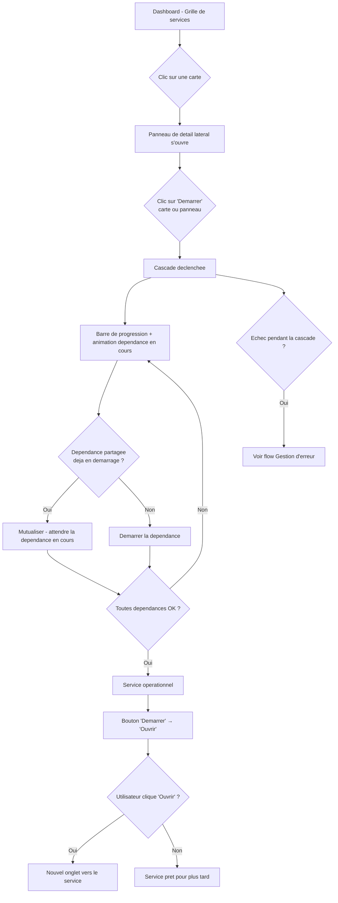
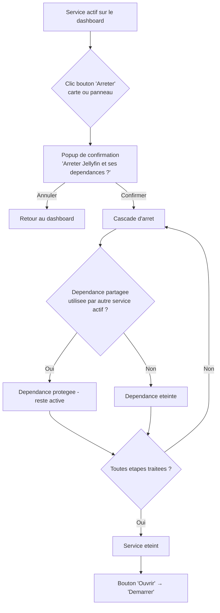
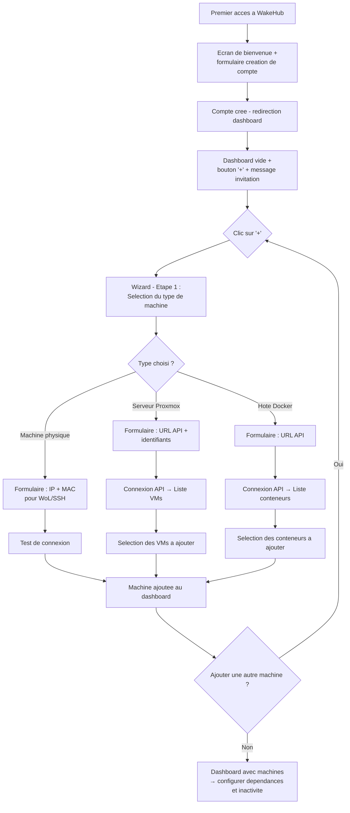
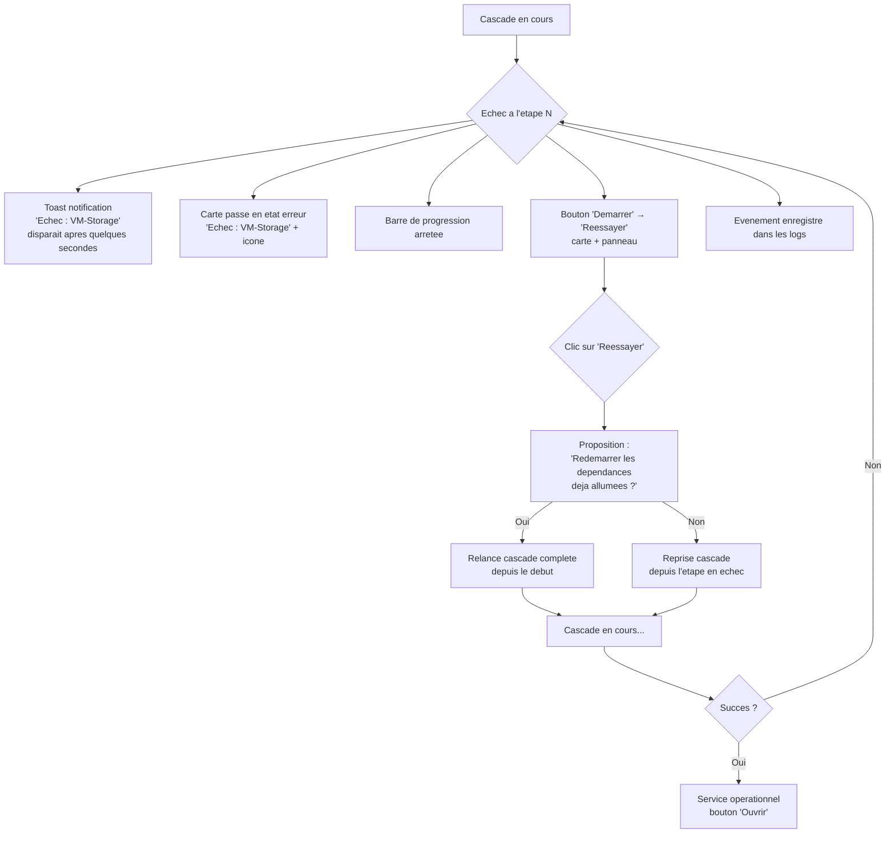

# UX Design Specification WakeHub

**Author:** Drunkrain
**Date:** 2026-02-08

---

## Executive Summary

### Project Vision

WakeHub est un dashboard centralise de gestion intelligente de l'alimentation pour homelab. L'experience cle : un clic sur un service declenche le demarrage automatique de toute la chaine de dependances (machine physique → VM → conteneur → service), avec redirection vers le service une fois operationnel. L'arret automatique sur inactivite eteint les ressources inutilisees tout en protegeant les dependances partagees. Aucun outil existant ne combine dashboard de services, cascade de dependances et arret automatique.

### Target Users

**Marc (pro)** — Sysadmin avec homelab avance. Veut remplacer ses scripts WoL/cron par un dashboard visuel fiable. Cherche la fiabilite, les logs detailles et le controle total.

**Sophie (intermediaire)** — Connait Docker et le reseau mais n'est pas sysadmin. Cherche une interface intuitive, une configuration guidee et des automatisations sans ligne de commande.

**Lucas (debutant)** — Raspberry Pi et quelques conteneurs Docker. Veut une installation ultra-simple (`docker compose up`), une prise en main immediate et de l'auto-detection.

**Emma (secondaire)** — Membre du foyer, utilisatrice des services (Jellyfin, Nextcloud). Ne connait pas WakeHub. Son experience doit etre transparente — tout fonctionne, toujours.

### Key Design Challenges

- **Progression de la cascade** : Rendre l'attente (jusqu'a 2 min) informative et rassurante avec un feedback visuel etape par etape, sans surcharger l'interface
- **Configuration des dependances** : Permettre a des utilisateurs non-experts de definir des chaines de dependances complexes via une interface visuelle intuitive (graphe, drag & drop)
- **Densite d'information vs. simplicite** : Afficher les statuts temps reel de toutes les ressources tout en maintenant une interface clean et scannable, style Homarr
- **Responsive sur interactions complexes** : Adapter la configuration des dependances et le graphe visuel aux ecrans mobiles et tablettes

### Design Opportunities

- **Le "clic magique"** : Transformer le demarrage en cascade en moment UX memorable grace a une progression visuelle animee etape par etape
- **Transparence intelligente** : Integrer les raisons des decisions systeme (arrets annules, dependances protegees) directement dans le dashboard de maniere subtile et contextuelle
- **Style Homarr-like enrichi** : Reprendre les codes d'Homarr (grille de cartes, dark mode, icones riches, minimalisme fonctionnel) en y ajoutant les indicateurs d'alimentation et de cascade — un visuel unique dans l'ecosysteme homelab

### Usage Context

- **Appareils** : Desktop (principal), tablette et telephone
- **Frequence** : Usage ponctuel dans la journee (demarrage de services a la demande)
- **Inspiration visuelle** : Homarr — grille de cartes, dark mode, minimaliste, haute densite d'information avec clarte visuelle

## Core User Experience

### Defining Experience

L'experience fondamentale de WakeHub tient en un geste : **un clic sur une carte de service depuis le dashboard**. Ce clic declenche toute la magie — la cascade de dependances s'allume, l'utilisateur voit la progression en temps reel, et le service devient disponible.

Le dashboard EST l'application. C'est la premiere chose que l'utilisateur voit, c'est la ou il passe 95% de son temps, c'est la surface d'interaction principale. Chaque service est represente par une carte avec son icone, son nom et son statut.

**Boucle d'interaction principale :**
1. L'utilisateur ouvre WakeHub → voit le dashboard avec toutes les cartes de services
2. Il clique sur une carte → la carte s'anime pour montrer la cascade en cours
3. La carte affiche successivement chaque dependance en train de demarrer (nom + icone de la dependance)
4. Une fois le service pret, la carte revient a son etat normal avec un statut "actif" et un lien pour y acceder
5. L'utilisateur choisit d'ouvrir le service ou non — pas de redirection automatique

**Demarrer ≠ Naviguer :** L'utilisateur peut vouloir demarrer un service sans s'y rendre immediatement. WakeHub respecte cette intention en ne forcant jamais la redirection. Un bouton/lien "Ouvrir" apparait sur la carte une fois le service disponible.

### Platform Strategy

- **Web app responsive** : Desktop (principal), tablette et telephone
- **Desktop** : Experience complete — dashboard grille de cartes, configuration, logs, graphe de dependances
- **Tablette** : Experience quasi-complete — grille adaptee, interactions tactiles
- **Telephone** : Experience essentielle — demarrage/arret rapide, statuts, pas de configuration complexe
- **Interaction primaire** : Souris/clavier sur desktop, tactile sur mobile/tablette
- **Pas de mode offline** : WakeHub necessite le reseau local pour communiquer avec les machines
- **Temps reel** : Mises a jour des statuts via WebSocket/SSE sans rechargement de page

### Effortless Interactions

- **Demarrage d'un service** : Un seul clic. Pas de confirmation, pas de popup, pas d'etapes intermediaires. Le clic declenche immediatement la cascade. Une fine barre de progression s'affiche en bordure basse de la carte (style Portainer — ligne fine et coloree), indiquant l'avancement global de la cascade. Simultanement, le contenu de la carte s'anime pour afficher la dependance en cours d'allumage (nom + icone).
- **Visualisation de la cascade** : Double feedback — la barre de progression fine montre le "combien" (avancement global), l'animation de la carte montre le "quoi" (dependance en cours). L'utilisateur comprend ce qui se passe sans effort cognitif.
- **Statut en temps reel** : Chaque carte affiche son etat (eteint, en demarrage, actif, en arret, erreur) sans que l'utilisateur n'ait a rafraichir ou chercher l'information.
- **Ajout d'un service** : Un bouton "+" ou "Nouveau service" visible sur le dashboard lance un wizard guide qui accompagne l'utilisateur etape par etape.
- **Arret automatique** : Invisible. L'utilisateur ne fait rien — WakeHub eteint les services inactifs en arriere-plan. Seule trace : le statut de la carte change.

### Critical Success Moments

1. **Le premier clic** : L'utilisateur clique sur un service pour la premiere fois et voit la cascade s'animer sur la carte avec la barre de progression. Si ce moment est fluide et impressionnant, WakeHub a gagne.
2. **Le matin d'apres** : L'utilisateur revient et constate que les services se sont eteints automatiquement pendant la nuit. Le homelab est silencieux. Moment de satisfaction.
3. **La configuration initiale** : L'utilisateur ajoute sa premiere machine via le wizard, definit les dependances, et tout fonctionne du premier coup. Si ce moment echoue, l'utilisateur abandonne.
4. **L'echec transparent** : Une cascade echoue. L'utilisateur voit clairement quelle etape a echoue et pourquoi, directement sur la carte. Il peut corriger et relancer. Pas de frustration.

### Experience Principles

1. **Le dashboard est roi** — Tout part du dashboard et y revient. C'est la surface principale, le point d'entree unique. Chaque information critique doit etre visible sans navigation.
2. **Un clic, zero friction** — Demarrer un service ne doit jamais demander plus qu'un clic. Pas de confirmation, pas de modal, pas de menu contextuel. L'action est directe et immediate.
3. **Montrer, ne pas expliquer** — La progression de la cascade, les statuts, les erreurs — tout se communique visuellement sur les cartes elles-memes. L'utilisateur comprend d'un coup d'oeil.
4. **Respecter l'intention** — WakeHub demarre ce qu'on lui demande et eteint ce qui est inactif. Il ne redirige pas, ne popup pas, ne decide pas a la place de l'utilisateur.
5. **Guider les debutants, liberer les experts** — Wizard pour la configuration initiale, settings avancees pour la modification. Deux chemins, un seul produit.

## Desired Emotional Response

### Primary Emotional Goals

- **Controle serein** : L'utilisateur maitrise tout son homelab d'un coup d'oeil, sans effort ni stress. Pas le controle du sysadmin sous pression, mais celui de quelqu'un qui a le bon outil entre les mains.
- **Satisfaction du "ca marche tout seul"** : Le plaisir de constater que les services se sont eteints automatiquement, que tout redemarre en un clic, que le homelab est devenu intelligent.
- **Confiance inalterable** : Meme quand ca echoue, l'utilisateur sait exactement ce qui se passe et quoi faire. WakeHub ne cache rien, ne surprend pas negativement.
- **Fierte technique** : Le petit moment "wahou" quand la cascade s'anime, quand le graphe de dependances s'affiche, quand on realise que son homelab est plus malin qu'avant.

### Emotional Journey Mapping

| Moment | Emotion visee |
|---|---|
| Premiere ouverture (dashboard vide) | Curiosite et invitation — pas d'intimidation, un chemin clair pour commencer |
| Configuration initiale (wizard) | Accomplissement progressif — chaque etape validee renforce la confiance |
| Premier clic sur un service | Emerveillement — la carte s'anime, la barre progresse, la cascade s'allume |
| Attente de la cascade (~2 min) | Serenite informee — l'utilisateur voit ce qui se passe, pas d'anxiete |
| Service disponible | Satisfaction immediate — le bouton "Ouvrir" apparait, mission accomplie |
| Le matin d'apres (tout eteint) | Fierte silencieuse — le homelab est intelligent, ca fonctionne sans intervention |
| Cascade en echec | Calme et confiance — l'erreur est claire, l'etape en echec identifiee, la relance accessible |
| Consultation des logs | Transparence rassurante — chaque decision est expliquee, rien de mysterieux |
| Retour apres plusieurs jours | Familiarite — le dashboard est la, inchange, pret a servir |

### Micro-Emotions

**A cultiver :**
- **Confiance > Confusion** : Chaque etat, chaque action, chaque erreur est immediatement comprehensible
- **Accomplissement > Frustration** : La configuration guide plutot qu'elle n'interroge
- **Serenite > Anxiete** : L'attente pendant la cascade est informative, jamais stressante
- **Fierte > Indifference** : Les animations et le feedback visuel transforment des actions techniques en moments satisfaisants

**A eviter absolument :**
- **Anxiete pendant l'attente** : Pas de spinner generique sans contexte, pas de silence pendant la cascade
- **Confusion devant la complexite** : Pas de jargon non explique, pas d'ecrans surcharges
- **Sentiment d'etre submerge** : La configuration se fait etape par etape, jamais un mur de formulaires
- **Peur de casser quelque chose** : Les actions sont reversibles ou clairement expliquees dans leurs consequences

### Design Implications

- **Controle serein** → Dashboard epure avec statuts visibles d'un coup d'oeil, pas de surcharge informationnelle
- **Satisfaction du "ca marche tout seul"** → Indicateurs subtils d'arrets automatiques sur les cartes (ex: "Eteint automatiquement il y a 3h")
- **Confiance** → Messages d'erreur precis avec etape en echec, code et action suggeree. Jamais de "Erreur inconnue"
- **Fierte technique** → Animations de cascade soignees, barre de progression fluide, transitions visuelles polies
- **Zero anxiete** → Barre de progression + animation de carte = double feedback permanent pendant l'attente

### Emotional Design Principles

1. **Informer, jamais stresser** — Chaque etat d'attente affiche un feedback visuel clair. Le silence est interdit pendant les operations.
2. **Celebrer les succes en douceur** — Pas de fanfare, mais une transition visuelle satisfaisante quand un service passe en actif.
3. **Dedramatiser les echecs** — Une erreur n'est pas une catastrophe. C'est un message clair, une raison et un bouton "Relancer".
4. **Rendre le technique accessible** — Les dependances, les cascades, les regles d'inactivite — tout est presente visuellement, pas en jargon.
5. **Recompenser la decouverte** — Chaque nouvelle fonctionnalite decouverte (logs, graphe de dependances, stats) doit provoquer un "ah, c'est bien pense".

## UX Pattern Analysis & Inspiration

### Inspiring Products Analysis

#### Homarr — Le dashboard homelab de reference
- **Grille drag & drop** : Layout en grille ou chaque service est une carte repositionnable. Pas de YAML, pas de config fichier — tout se fait visuellement. L'utilisateur compose son dashboard comme un tableau de bord personnel.
- **Theming soigne** : Dark mode natif, respect des themes systeme, personnalisation CSS avancee. L'esthetique est moderne, epuree, avec 10K+ icones integrees.
- **Cartes riches** : Chaque carte peut etre un simple raccourci (icone + nom + URL) ou un widget avec donnees live (integration API). Format redimensionnable (1x1, 2x1, etc.).
- **Limitation identifiee** : Pas de gestion d'alimentation, pas de statut on/off interactif, pas de feedback d'action. Les cartes sont passives — elles affichent mais n'agissent pas.

#### Portainer — La reference de gestion de conteneurs
- **Layout en liste/tableau** : Vue tabulaire des conteneurs avec statut colore (vert = running, rouge = stopped). Tout visible en un coup d'oeil sans cliquer.
- **Summary tiles** : Dashboard d'accueil avec des tuiles resumant l'etat global (nombre de stacks, conteneurs, images, volumes). Vue d'ensemble instantanee.
- **Barre de progression** : Ligne fine coloree en haut de la fenetre lors des operations de chargement. Feedback subtil mais efficace.
- **Navigation sidebar** : Menu lateral persistant pour naviguer entre les sections (Dashboard, Containers, Images, Volumes, Networks).
- **Limitation identifiee** : Interface fonctionnelle mais utilitaire. Pas de "wahou" visuel, pas d'animations, pas de dark mode natif elegant.

### Transferable UX Patterns

**Patterns de navigation :**
- **Grille de cartes personnalisable** (Homarr) → Dashboard principal WakeHub. Chaque service est une carte dans une grille. L'utilisateur peut reorganiser selon ses preferences.
- **Sidebar de navigation** (Portainer) → Navigation entre Dashboard, Settings, Logs. Menu lateral persistant sur desktop, hamburger sur mobile.

**Patterns d'interaction :**
- **Statut visuel colore** (Portainer) → Indicateur de couleur sur chaque carte (vert = actif, rouge = eteint, jaune = en demarrage, orange = erreur). Comprehension instantanee.
- **Summary tiles** (Portainer) → En-tete du dashboard avec resume : "X services actifs / Y eteints / Z en erreur". Vue d'ensemble avant le detail.
- **Barre de progression fine** (Portainer) → Barre de progression en bordure basse de la carte pendant la cascade. Meme pattern, applique a la carte au lieu de la fenetre.

**Patterns visuels :**
- **Dark mode + icones riches** (Homarr) → Theme sombre par defaut, bibliotheque d'icones integree pour chaque service (Jellyfin, Nextcloud, Proxmox, etc.).
- **Cartes redimensionnables** (Homarr) → Possibilite de cartes compactes (icone + nom) ou etendues (avec infos supplementaires comme l'uptime ou le dernier arret auto).

### Anti-Patterns to Avoid

- **Cartes passives sans feedback** (Homarr) → Les cartes WakeHub doivent etre interactives : clic = action, animation = retour visuel. Pas de carte morte.
- **Interface purement utilitaire** (Portainer) → WakeHub vise la fierte technique. Les animations, les transitions et le polish visuel ne sont pas optionnels.
- **Mur de configuration YAML/JSON** → Tout se configure via l'interface. Wizard guide pour la premiere config, settings visuels pour les modifications.
- **Surcharge informationnelle** → Pas de tableau a 15 colonnes. Les cartes montrent l'essentiel (icone, nom, statut), le detail est accessible au clic.
- **Mobile comme afterthought** (Homarr) → WakeHub doit etre utilisable sur telephone des le depart. La grille s'adapte, les cartes restent cliquables.

### Design Inspiration Strategy

**A adopter directement :**
- Grille de cartes avec icones riches comme surface principale (Homarr)
- Dark mode soigne comme theme par defaut (Homarr)
- Statuts colores instantanement lisibles sur chaque element (Portainer)
- Barre de progression fine pour les operations en cours (Portainer)
- Sidebar de navigation pour desktop (Portainer)

**A adapter pour WakeHub :**
- Cartes Homarr → enrichir avec statut interactif, animation de cascade, bouton "Ouvrir"
- Summary tiles Portainer → adapter en en-tete dashboard avec resume des services actifs/eteints
- Grille personnalisable Homarr → simplifier le drag & drop pour rester accessible aux debutants

**A eviter :**
- Cartes purement decoratives sans interaction (Homarr)
- Interface grise et utilitaire sans emotion (Portainer)
- Configuration par fichier ou CLI uniquement
- Mobile non-responsive ou degrade

## Design System Foundation

### Design System Choice

**Mantine** — Bibliotheque de composants React complete avec theming avance et dark mode natif.

- **Version** : Mantine v7+ (derniere version stable)
- **Styling** : CSS Modules + Mantine theme system (PostCSS)
- **Composants** : 130+ composants prets a l'emploi (Grid, Card, Modal, Notification, AppShell, etc.)
- **Icones** : Integration avec Tabler Icons (inclus par defaut) + bibliotheque d'icones de services homelab (dashboard-icons)

### Rationale for Selection

- **Alignement Homarr** : Homarr utilise Mantine — les patterns visuels et comportements seront naturellement proches de l'inspiration cible
- **Dark mode natif** : Le theming dark/light est integre au coeur du systeme, pas un ajout apres coup
- **Rapidite de developpement** : 130+ composants evitent de reinventer la roue (AppShell pour le layout, Grid pour la grille de cartes, Progress pour la barre de cascade, Notifications pour les feedbacks)
- **Theming puissant** : Variables CSS centralisees, surcharge facile des couleurs, espacements, bordures — personnalisation du look sans casser les composants
- **Dev solo friendly** : Documentation excellente, API coherente, moins de decisions a prendre qu'avec une approche utility-first
- **Responsive integre** : Systeme de breakpoints et composants adaptatifs natifs

### Implementation Approach

**Layout principal (AppShell) :**
- `AppShell` Mantine pour la structure globale : sidebar + header + main content
- Sidebar collapsable sur desktop, hamburger menu sur mobile
- Header avec summary tiles (services actifs/eteints)

**Dashboard (Grid + Card) :**
- `SimpleGrid` ou `Grid` Mantine pour la grille de cartes responsive
- `Card` Mantine comme base pour les cartes de services, personnalisees avec statut, animation et barre de progression
- `Progress` Mantine pour la barre fine en bordure basse de la carte pendant la cascade

**Theming :**
- Theme dark par defaut avec palette de couleurs personnalisee
- Couleurs semantiques : vert (actif), rouge (eteint), jaune (en demarrage), orange (erreur)
- Variables de theme centralisees pour coherence globale

**Animations :**
- Transitions CSS + Mantine `Transition` component pour les animations de cartes
- Animations de cascade sur les cartes (changement de contenu avec transition fluide)

### Customization Strategy

**Ce qu'on utilise tel quel :**
- AppShell, Grid, Modal, Notification, TextInput, PasswordInput, Stepper (wizard), Table (logs)
- Theming dark/light, systeme de couleurs, espacements

**Ce qu'on personnalise :**
- `Card` → carte de service WakeHub avec statut interactif, barre de progression, animation de cascade, bouton "Ouvrir"
- `Progress` → barre fine en bordure basse de carte (positionnement custom)
- Palette de couleurs → couleurs specifiques WakeHub pour les statuts et l'identite visuelle
- `AppShell` → header avec summary tiles personnalises

**Ce qu'on cree from scratch :**
- Animation de cascade sur la carte (transition entre contenu service et contenu dependance en cours)
- Graphe de dependances (probablement avec une lib dediee type React Flow, integree au theme Mantine)
- Wizard de configuration de service (base Stepper Mantine, contenu custom)

## Defining Core Experience

### Defining Experience

**L'experience WakeHub en une phrase :** "Tu cliques sur un service, tout s'allume tout seul, et ca s'eteint quand t'as fini."

C'est l'interaction qui definit le produit. Deux temps indissociables :

**Le clic magique** — L'utilisateur clique sur une carte de service. La cascade de dependances s'execute automatiquement. La carte s'anime, la barre de progression avance, chaque dependance s'affiche au fur et a mesure. Le service devient disponible. Bouton "Ouvrir" accessible.

**L'intelligence invisible** — Sans aucune action utilisateur, les services inactifs s'eteignent apres le delai configure. Le homelab se gere tout seul. L'utilisateur decouvre le lendemain que tout est proprement eteint.

### User Mental Model

**Avant WakeHub (modele actuel) :**
L'utilisateur pense en etapes techniques sequentielles — allumer le NAS (WoL), demarrer la VM (Proxmox), lancer le conteneur (Portainer/CLI), ouvrir le service, puis se souvenir d'eteindre. Chaque etape est un outil different, une interface differente, un effort mental.

**Avec WakeHub (modele cible) :**
L'utilisateur pense en services, pas en machines. "Je veux Jellyfin" → clic → c'est pret. L'infrastructure sous-jacente est abstraite. Le modele mental passe de **"je gere des machines"** a **"je lance des services"**.

**Points de friction anticipes :**
- La notion de "dependance" peut etre abstraite pour les debutants → le wizard de configuration doit rendre ca visuel et concret
- L'attente de la cascade (~2 min) peut sembler longue si le feedback est insuffisant → double feedback (barre + animation) resolu a l'etape 3
- L'arret automatique peut surprendre si l'utilisateur ne comprend pas les regles → indicateur subtil sur la carte ("Arret auto dans X min")

### Success Criteria

**L'utilisateur dit "ca marche" quand :**
- Un clic sur une carte declenche immediatement la cascade — pas de delai, pas de confirmation
- La progression est visible en temps reel sur la carte (barre + dependance en cours)
- Le service est disponible en moins de 2 minutes
- Le bouton "Ouvrir" apparait des que le service est pret
- Les services s'eteignent automatiquement sans intervention

**L'utilisateur dit "c'est bien fait" quand :**
- Une erreur de cascade affiche un toast immediat avec le probleme + la carte reste en etat d'erreur avec le detail
- Les notifications sont consultables dans une section dediee (historique, comme Portainer)
- L'arret manuel demande confirmation (popup) pour eviter les erreurs
- Les logs expliquent chaque decision du systeme

**Indicateurs de succes :**
- Temps entre le clic et le debut visuel de la cascade : < 1 seconde
- Temps de cascade complete : < 2 minutes
- Taux de comprehension du statut d'un coup d'oeil : l'utilisateur identifie l'etat de chaque service sans cliquer

### Novel UX Patterns

**Patterns etablis utilises :**
- Grille de cartes (Homarr, dashboards classiques) — familier, pas besoin d'apprentissage
- Toast notifications (Portainer, apps web modernes) — feedback immediat compris de tous
- Sidebar navigation (Portainer, apps web) — navigation standard
- Popup de confirmation pour actions destructives — pattern universel

**Combinaison innovante WakeHub :**
- **Carte interactive avec cascade animee** — Aucun dashboard homelab ne transforme une carte en visualisation temps reel d'un processus multi-etapes. C'est un pattern nouveau qui combine la familiarite de la carte avec le feedback d'un processus asynchrone.
- **Barre de progression sur la carte** — Le pattern Portainer (barre en haut de fenetre) applique a l'echelle de chaque carte individuelle. Micro-pattern nouveau, metaphore familiere.
- **Arret automatique invisible avec transparence a la demande** — L'arret se fait en silence, mais l'information est toujours accessible (section notifications, logs). Pattern "invisible par defaut, transparent sur demande".

**Pas besoin d'education utilisateur** — Tous les patterns de base (clic, cartes, notifications, sidebar) sont familiers. La seule nouveaute (animation de cascade) se comprend d'elle-meme en la voyant fonctionner.

### Experience Mechanics

**1. Initiation — Demarrage d'un service :**
- L'utilisateur voit le dashboard avec toutes les cartes
- Il identifie le service voulu grace a l'icone, le nom et le statut (rouge = eteint)
- Il clique sur la carte

**2. Interaction — Cascade en cours :**
- La carte passe en mode "cascade" : le contenu s'anime pour afficher la dependance en cours (nom + icone)
- La barre de progression fine apparait en bordure basse de la carte
- Les dependances defilent au fur et a mesure de leur demarrage
- Le statut de la carte passe a "en demarrage" (jaune)

**3. Feedback — Succes ou echec :**
- **Succes** : La carte revient a son etat normal, statut "actif" (vert), bouton "Ouvrir" visible. Transition fluide.
- **Echec** : Toast notification immediat avec le message d'erreur. La carte affiche l'etape en echec avec le detail. La barre de progression s'arrete. Bouton "Relancer" disponible sur la carte. L'evenement est enregistre dans la section notifications.

**4. Completion — Service disponible :**
- La carte affiche le service actif avec son icone, son nom et le bouton "Ouvrir"
- L'utilisateur clique sur "Ouvrir" s'il veut acceder au service (nouvel onglet)
- Ou il ne fait rien — le service est pret pour plus tard

**5. Cycle de vie — Arret :**
- **Arret automatique** : Apres le delai d'inactivite, WakeHub eteint le service et ses dependances (si aucun autre dependant actif). Toast discret. Evenement dans la section notifications.
- **Arret manuel** : L'utilisateur clique sur le bouton stop de la carte. Popup de confirmation ("Arreter Jellyfin et ses dependances ?"). Confirmation → cascade d'arret. La carte passe en "en arret" puis "eteint".

## Visual Design Foundation

### Color System

**Theme : Dark mode par defaut** — Fond sombre, texte clair, accents bleu tech.

**Couleur principale :**
- **Bleu tech** (`#339AF0` / Mantine `blue.5`) — Accent principal, liens, boutons primaires, barre de progression de cascade
- Choisi pour l'association tech + energie, lisible sur fond sombre, coherent avec l'ecosysteme homelab

**Couleurs de fond (dark mode) :**
- **Background principal** : `#1A1B1E` (Mantine `dark.8`) — Fond de l'application
- **Background cartes** : `#25262B` (Mantine `dark.7`) — Surface des cartes, sidebar, modals
- **Background eleve** : `#2C2E33` (Mantine `dark.6`) — Elements sureleves (hover, tooltips)

**Couleurs de fond (light mode) :**
- **Background principal** : `#FFFFFF` — Fond de l'application
- **Background cartes** : `#F8F9FA` (Mantine `gray.0`) — Surface des cartes
- **Background eleve** : `#F1F3F5` (Mantine `gray.1`) — Elements sureleves

**Couleurs semantiques de statut :**
- **Actif / Succes** : `#51CF66` (Mantine `green.5`) — Service en ligne, cascade reussie
- **Eteint / Inactif** : `#868E96` (Mantine `gray.6`) — Service arrete, inactif
- **En demarrage / En cours** : `#FCC419` (Mantine `yellow.5`) — Cascade en cours, demarrage
- **Erreur** : `#FF6B6B` (Mantine `red.5`) — Echec de cascade, erreur de connexion
- **En arret** : `#FF922B` (Mantine `orange.5`) — Service en cours d'extinction

**Couleurs de texte :**
- **Texte principal** : `#C1C2C5` (Mantine `dark.0`) en dark, `#212529` (Mantine `dark.9`) en light
- **Texte secondaire** : `#909296` (Mantine `dark.3`) en dark, `#868E96` (Mantine `gray.6`) en light
- **Texte sur accent** : `#FFFFFF` — Texte sur boutons bleus ou badges colores

**Ratios de contraste :**
- Tous les couples texte/fond respectent WCAG AA (ratio minimum 4.5:1)
- Les couleurs de statut sont accompagnees d'icones ou de labels — jamais dependantes de la couleur seule

### Typography System

**Police principale : Inter** — Sans-serif geometrique moderne, excellente lisibilite sur ecran, integree a Mantine par defaut.

**Police monospace : JetBrains Mono** — Pour les logs, adresses IP, noms de machines, code. Lisibilite technique sans compromettre le look moderne.

**Echelle typographique :**

| Element | Taille | Poids | Usage |
|---|---|---|---|
| H1 | 28px | 700 (Bold) | Titre de page (Dashboard, Settings, Logs) |
| H2 | 22px | 600 (SemiBold) | Titre de section |
| H3 | 18px | 600 (SemiBold) | Sous-section, titres de cartes |
| Body | 16px | 400 (Regular) | Texte courant, descriptions |
| Small | 14px | 400 (Regular) | Labels, metadata, texte secondaire |
| Caption | 12px | 400 (Regular) | Timestamps, hints, badges |
| Mono | 14px | 400 (Regular) | Logs, IPs, noms techniques |

**Interligne :** 1.55 (defaut Mantine) — Genereux pour la lisibilite, coherent avec le layout aere.

### Spacing & Layout Foundation

**Unite de base : 8px** — Systeme d'espacement Mantine (multiples de 4px/8px).

**Grille d'espacement :**

| Token | Valeur | Usage |
|---|---|---|
| xs | 8px | Espacement interne compact (entre icone et texte) |
| sm | 12px | Espacement interne standard (padding de badges) |
| md | 16px | Espacement entre elements proches (items d'une liste) |
| lg | 24px | Espacement entre sections (entre les cartes) |
| xl | 32px | Espacement entre blocs majeurs (sections de page) |

**Layout global :**
- **AppShell** : Sidebar 260px (collapsable a 80px), header 60px
- **Grille de cartes** : `SimpleGrid` responsive — 4 colonnes desktop, 2 colonnes tablette, 1 colonne telephone
- **Gap entre cartes** : `lg` (24px) — Aere, chaque carte respire
- **Padding des cartes** : `md` (16px) — Assez d'espace interne sans gaspiller
- **Padding de page** : `xl` (32px) desktop, `md` (16px) mobile

**Principes de layout :**
- **Aere mais informatif** : Les espaces genereux entre les cartes permettent de scanner rapidement tout en gardant les infos cles visibles sur chaque carte (icone, nom, statut)
- **Hierarchie par la taille** : Les summary tiles en haut, les cartes de services en dessous, les details au clic
- **Responsive fluid** : La grille s'adapte au viewport, les cartes gardent leur proportion, le contenu se reorganise sans se casser

### Accessibility Considerations

- **Contraste WCAG AA** : Ratio minimum 4.5:1 pour tout texte, verifie sur dark et light mode
- **Couleur non-seule** : Chaque statut combine couleur + icone + label textuel. Un utilisateur daltonien identifie les etats sans probleme
- **Navigation clavier** : Focus visible sur tous les elements interactifs (cartes, boutons, liens). Ring bleu tech en focus.
- **Labels ARIA** : Tous les boutons d'action (demarrer, arreter, ouvrir) ont des labels explicites
- **Taille de cible tactile** : Minimum 44x44px pour tous les elements interactifs (norme mobile)
- **Motion reduite** : Les animations de cascade respectent `prefers-reduced-motion` — fallback sur transitions instantanees

## Design Direction Decision

### Design Directions Explored

6 directions de design explorees via un showcase HTML interactif (`ux-design-directions.html`) :

1. **Classic Grid + Sidebar** — Layout Homarr-like, sidebar 260px, grille 4 colonnes
2. **Compact List + Icon Sidebar** — Vue tabulaire Portainer-like, maximum d'info par ligne
3. **Dashboard Tiles + Stats** — Bandeau de statistiques, cartes larges avec dependances
4. **Minimal Cards sans bordures** — Ultra-clean, hover scale, look premium
5. **Split View (Grille + Detail)** — Master-detail avec panneau lateral
6. **Kanban par statut** — Colonnes par statut, vision instantanee

### Chosen Direction

**Direction hybride combinant les directions 2, 3 et 5 :**

#### Dashboard principal (base Direction 3 + panneau Direction 5)

**Structure :**
- **Header** : Logo WakeHub + navigation (Dashboard, Machines, Settings, Logs, Notifications)
- **Stats tiles** : Bandeau de 4 tuiles en haut — services actifs, cascades du jour, temps moyen de cascade, economie d'energie estimee
- **Grille de services** : Tiles larges (3 colonnes desktop) des services epingles par l'utilisateur. Chaque tile affiche icone, nom, statut, type de plateforme et chaine de dependances resumee
- **Panneau de detail lateral** : Au clic sur une tile, un panneau s'ouvre a droite (380px) affichant la chaine de dependances complete (avec statut de chaque maillon), les logs recents de ce service, et les actions (Ouvrir, Arreter/Demarrer, Relancer)

**Comportement :**
- Le dashboard reste visible a gauche quand le panneau de detail est ouvert
- La grille se reduit a 2 colonnes pour laisser place au panneau
- Le panneau se ferme au clic sur un bouton "X" ou en cliquant en dehors
- Sur mobile : le panneau s'ouvre en plein ecran (bottom sheet ou page modale)

#### Page Machines (base Direction 2)

**Structure :**
- **Vue tabulaire compacte** : Liste de toutes les machines physiques, VMs et conteneurs
- **Colonnes** : Icone, nom, statut (badge colore), plateforme, adresse IP, derniere activite
- **Filtres/tri** : Par statut, par plateforme, par nom
- **Densite** : Beaucoup de lignes visibles sans scroll — concu pour les homelabs avec 20+ machines

**Comportement :**
- Au clic sur une ligne → **navigation vers une page dediee** de detail/modification de la machine
- Pas de panneau lateral — l'utilisateur accede a une page complete avec tous les parametres

#### Page Detail Machine (page complete)

**Structure :**
- **En-tete** : Icone, nom, statut, plateforme, adresse IP
- **Section Parametres** : Tous les parametres editables de la machine/VM/conteneur (IP, MAC, URL API, identifiants, etc.)
- **Section Dependances** : Visualisation et modification des liens de dependance
- **Section Regles d'inactivite** : Configuration du delai et des criteres d'inactivite pour cette machine
- **Section Logs** : Historique complet des operations liees a cette machine
- **Actions** : Test de connexion, demarrer, arreter, supprimer

**Comportement :**
- Bouton "Retour" pour revenir a la page Machines
- Modifications sauvegardees via bouton "Enregistrer" explicite
- Suppression protegee par popup de confirmation

### Design Rationale

- **Dashboard (D3+D5)** : Les stats tiles donnent une vue d'ensemble instantanee. Les service tiles larges permettent d'afficher plus d'info que des cartes compactes. Le panneau de detail lateral permet de consulter dependances et logs sans quitter le dashboard — ideal pour l'usage quotidien rapide.
- **Machines (D2)** : La vue tabulaire est la plus efficace pour gerer beaucoup de ressources. Un clic mene a une page dediee car la modification de parametres demande de l'espace et de la concentration — pas un panneau lateral.
- **Separation des contextes** : Dashboard = "je veux utiliser mes services" (acces rapide, consultation). Machines = "je veux configurer mon infra" (gestion, modification). Deux besoins, deux layouts.

### Implementation Approach

**Navigation globale :**

| Page | Layout | Interaction au clic |
|---|---|---|
| Dashboard | Stats tiles + grille de service tiles (3 col) | Panneau lateral de detail (380px) |
| Machines | Liste tabulaire compacte | Navigation vers page dediee detail/modification |
| Settings | Formulaires de configuration | — |
| Logs | Table chronologique filtrable | — |
| Notifications | Liste chronologique | — |

**Composants Mantine utilises :**
- `AppShell` : Layout global avec header et navigation
- `SimpleGrid` + `Card` : Service tiles sur le dashboard
- `Table` : Vue tabulaire page Machines
- `Drawer` ou panneau custom : Detail lateral sur le dashboard
- `Stepper` : Wizard d'ajout de service
- `Progress` : Barre de progression sur les tiles
- `Notification` : Toast de feedback
- `Modal` : Popups de confirmation (arret, suppression)
- `Stats` / `Paper` : Stats tiles du dashboard

## User Journey Flows

### Demarrage d'un service en cascade

**Declencheur :** L'utilisateur veut acceder a un service actuellement eteint.

**Points d'entree :**
- Bouton "Demarrer" visible directement sur la carte du service dans la grille du dashboard
- Bouton "Demarrer" dans le panneau de detail lateral (ouvert au clic sur la carte)

**Mecanique d'interaction :**
- Clic sur la carte → ouvre le panneau de detail lateral (pas de cascade)
- Clic sur le bouton "Demarrer" (carte ou panneau) → declenche la cascade immediatement, sans confirmation
- Pendant la cascade : barre de progression fine en bordure basse de la carte + animation de la dependance en cours
- Succes : le bouton "Demarrer" est remplace par "Ouvrir" (carte et panneau). Clic sur "Ouvrir" → nouvel onglet vers le service
- Plusieurs cascades peuvent tourner simultanement. Les dependances partagees deja en cours de demarrage sont detectees et mutualisees



**Arret manuel :**



### Premiere configuration / Onboarding

**Declencheur :** Premier lancement de WakeHub apres `docker compose up`.

**Mecanique d'interaction :**
- Premier acces → ecran de creation de compte avec message de bienvenue au-dessus du formulaire (username + mot de passe + confirmation)
- Apres creation → dashboard vide avec bouton "+" et message d'invitation ("Ajoutez votre premiere machine")
- L'utilisateur explore a son rythme, pas de wizard force
- Clic sur "+" → wizard d'ajout de machine avec selection du type en premiere etape (Machine physique WoL/SSH, Serveur Proxmox, Hote Docker)
- Pour Proxmox/Docker : apres connexion API, le systeme liste les VMs/conteneurs et l'utilisateur selectionne lesquels ajouter
- Configuration des dependances et regles d'inactivite dans les pages dediees



### Gestion d'erreur de cascade

**Declencheur :** Une etape de la cascade echoue pendant le demarrage d'un service.

**Mecanique d'interaction :**
- Echec detecte → toast notification immediat (disparait apres quelques secondes) avec message simple
- La carte affiche un detail simple de l'echec (ex: "Echec : VM-Storage") avec icone erreur
- La barre de progression s'arrete
- Le bouton "Demarrer" est remplace par un bouton **"Reessayer"** sur la carte ET dans le panneau lateral
- Les dependances deja demarrees restent actives (pas de rollback automatique)
- Clic sur "Reessayer" → proposition : redemarrer les dependances deja allumees ou reprendre la ou ca a echoue
- L'evenement est enregistre dans les logs avec detail complet



### Diagnostic et logs

**Declencheur :** L'utilisateur cherche a comprendre un comportement du systeme (ex: pourquoi une VM reste active).

**Points d'entree :**
- Page Logs globale via la navigation principale
- Logs specifiques a une machine/service dans le panneau de detail lateral du dashboard

**Mecanique d'interaction :**
- La page Logs affiche un tableau chronologique avec colonnes : horodatage, machine/service, type d'evenement, description, **raison de la decision**
- Filtrage par : machine/service, stack de dependances, type d'evenement (demarrage, arret, erreur, decision), periode
- Champ de recherche libre en complement des filtres
- Les logs dans le panneau lateral sont filtres automatiquement pour la machine/service concernee

```mermaid
flowchart TD
    A{Point d'entree} -->|Navigation principale| B[Page Logs globale]
    A -->|Panneau lateral dashboard| C[Logs filtres par machine/service]

    B --> D[Tableau chronologique<br/>horodatage | machine | type | description | raison]
    C --> D

    D --> E{Filtrage}
    E --> F[Par machine/service]
    E --> G[Par stack de dependances]
    E --> H[Par type d'evenement<br/>demarrage/arret/erreur/decision]
    E --> I[Par periode]
    E --> J[Recherche libre]

    F --> K[Resultats filtres]
    G --> K
    H --> K
    I --> K
    J --> K

    K --> L[Lecture de la colonne 'raison'<br/>ex: 'Arret annule — dependant actif :<br/>qBittorrent 72h']
    L --> M[Utilisateur comprend le comportement<br/>et peut agir]
```

### Journey Patterns

**Patterns de navigation :**
- **Carte → Panneau lateral** : Le clic sur une carte ouvre toujours le panneau de detail. Les actions (demarrer, arreter, ouvrir, reessayer) sont accessibles sur la carte ET dans le panneau
- **Double point d'entree logs** : Page globale + panneau lateral filtre. Memes donnees, contexte different

**Patterns d'interaction :**
- **Bouton contextuel unique** : Un seul bouton d'action principal sur la carte, qui change selon l'etat : Demarrer → Ouvrir (succes) / Reessayer (echec). Pas de surcharge de boutons
- **Confirmation pour les actions destructives uniquement** : Demarrer = pas de confirmation. Arreter = popup de confirmation. Coherent et previsible
- **Cascades paralleles** : Plusieurs services peuvent demarrer simultanement, les dependances partagees sont mutualisees automatiquement

**Patterns de feedback :**
- **Toast ephemere + etat persistant** : Les toasts informent puis disparaissent. L'etat de la carte (erreur, actif, eteint) persiste comme reference stable
- **Double feedback de progression** : Barre de progression (avancement global) + animation carte (dependance en cours). Deux niveaux d'information simultanees

### Flow Optimization Principles

- **Un seul bouton, pas de friction** : Le bouton principal de la carte est toujours l'action la plus pertinente selon le contexte. Zero ambiguite
- **Exploration libre pour l'onboarding** : Pas de wizard force au premier lancement. Le dashboard vide invite a agir sans contraindre
- **Echec sans panique** : L'erreur est simple sur la carte, detaillee dans les logs. L'utilisateur n'est pas submerge mais l'information est toujours accessible
- **Logs comme source de verite** : Chaque decision du systeme est tracee avec sa raison. La transparence totale construit la confiance
- **Parallelisme intelligent** : Les cascades simultanees mutualisent les dependances partagees — pas de conflits, pas de demarrages redondants

## Component Strategy

### Design System Components

**Mantine v7+ — Composants utilises tels quels :**

| Composant Mantine | Usage dans WakeHub |
|---|---|
| `AppShell` | Layout global : header + zone de contenu principale |
| `SimpleGrid` | Grille responsive des ServiceTiles sur le dashboard |
| `Table` | Page Machines (vue tabulaire) + Page Logs (tableau chronologique) |
| `Drawer` | Conteneur du panneau de detail lateral (380px desktop, fullscreen mobile) |
| `Modal` | Popups de confirmation (arret manuel, suppression de machine) |
| `Stepper` | Wizard d'ajout de machine (selection type → formulaire → test connexion) |
| `Notification` | Toasts ephemeres (succes cascade, echec, arret automatique) |
| `TextInput` / `PasswordInput` / `Select` | Formulaires de configuration et creation de compte |
| `Badge` | Badges de statut sur les cartes et dans la page Machines |
| `Button` | Boutons d'action (Demarrer, Ouvrir, Reessayer, Arreter, Enregistrer) |
| `ActionIcon` | Boutons icone compacts (fermer panneau, actions secondaires) |
| `Tabs` | Organisation des sections dans le panneau lateral (Dependances, Logs, Actions) |
| `Paper` | Conteneurs des stats tiles dans le bandeau du dashboard |
| `Progress` | Base pour la barre de progression de cascade (personnalisee dans CascadeProgress) |
| `Transition` | Animations de changement d'etat sur les cartes |
| `NavLink` | Navigation principale (Dashboard, Machines, Settings, Logs, Notifications) |

**Composants Mantine personnalises (theming) :**
- `Card` → surcharge de style pour les ServiceTiles (fond, bordures, padding)
- `Progress` → repositionnement en bordure basse de la carte (hauteur 3px)
- `Badge` → couleurs semantiques de statut (vert, rouge, jaune, orange, gris)

### Custom Components

#### ServiceTile

**Purpose :** Composant central du dashboard — represente un service dans la grille. Affiche l'etat du service et fournit les actions principales (demarrer, ouvrir, arreter, reessayer).

**Usage :** Grille du dashboard. Chaque service configure dans WakeHub est represente par un ServiceTile.

**Anatomy :**
- **Icone du service** : Icone de la bibliotheque dashboard-icons (Jellyfin, Nextcloud, Proxmox, etc.) ou Tabler Icons par defaut
- **Nom du service** : Titre principal (H3, 18px SemiBold)
- **Badge de statut** : Badge colore indiquant l'etat (Actif, Eteint, En demarrage, Erreur, En arret)
- **Info plateforme** : Type de plateforme en texte secondaire (Docker, Proxmox VM, Machine physique)
- **Resume dependances** : Chaine de dependances resumee en une ligne (ex: "NAS → VM-Media → Jellyfin")
- **Bouton d'action principal** : Demarrer / Ouvrir / Reessayer / Arreter selon l'etat
- **Zone CascadeProgress** : Barre de progression + animation dependance en cours (visible uniquement pendant la cascade)

**States :**

| Etat | Badge | Bouton principal | Comportement |
|---|---|---|---|
| Eteint | Gris "Eteint" | "Demarrer" (bleu) | Clic → declenche la cascade |
| En demarrage | Jaune "En demarrage" | Desactive (loading) | CascadeProgress visible |
| Actif | Vert "Actif" | "Ouvrir" (bleu) | Clic → nouvel onglet vers le service |
| Erreur | Rouge "Erreur" | "Reessayer" (orange) | Detail simple de l'echec visible |
| En arret | Orange "En arret" | Desactive (loading) | Cascade d'arret en cours |

**Variants :**
- Taille unique responsive (s'adapte a la largeur de colonne de la grille)
- Mode compact implicite sur mobile (reduction du padding, masquage du resume dependances)

**Accessibility :**
- `role="article"` avec `aria-label="Service [nom] — [statut]"`
- Bouton d'action avec `aria-label` explicite ("Demarrer Jellyfin", "Ouvrir Jellyfin")
- Clic sur la carte entiere (hors bouton) → ouvre le panneau lateral : `role="button"` sur la zone cliquable
- Focus visible (ring bleu) sur la carte et le bouton d'action separement
- Navigation clavier : Tab entre les cartes, Enter pour ouvrir le panneau, Tab vers le bouton d'action

**Interaction Behavior :**
- Clic sur la carte (hors bouton) → ouvre le ServiceDetailPanel
- Clic sur le bouton d'action → action contextuelle (demarrer, ouvrir, reessayer)
- Hover → legere elevation de la carte (shadow + translate Y -2px)

#### CascadeProgress

**Purpose :** Affiche la progression en temps reel d'une cascade de demarrage directement sur le ServiceTile. Double feedback : avancement global + dependance en cours.

**Usage :** Integre dans le ServiceTile pendant l'etat "En demarrage". Disparait une fois la cascade terminee (succes ou echec).

**Anatomy :**
- **Barre de progression** : Ligne fine (3px) en bordure basse de la carte, couleur bleu tech, progression proportionnelle au nombre de dependances
- **Animation dependance** : Zone texte dans la carte affichant le nom + icone de la dependance en cours de demarrage, avec transition fluide entre chaque etape

**States :**

| Etat | Barre | Animation |
|---|---|---|
| Cascade en cours | Progression proportionnelle (bleu) | Nom + icone dependance courante avec transition |
| Cascade reussie | Barre complete (vert, flash) puis disparait | Transition vers etat normal du ServiceTile |
| Cascade en echec | Barre arretee (rouge) | Affiche la dependance en echec |

**Variants :** Aucune — composant unique integre au ServiceTile.

**Accessibility :**
- `role="progressbar"` avec `aria-valuenow`, `aria-valuemin`, `aria-valuemax`
- `aria-label="Demarrage en cours — etape [N] sur [total] : [nom dependance]"`
- Respecte `prefers-reduced-motion` : pas d'animation de transition, changement instantane

**Interaction Behavior :**
- Pas d'interaction directe — composant informatif uniquement
- Les mises a jour arrivent en temps reel via WebSocket/SSE
- Transition fluide entre chaque etape de dependance (fade out/in, 200ms)

#### ServiceDetailPanel

**Purpose :** Panneau lateral affichant le detail complet d'un service : chaine de dependances avec statut de chaque maillon, logs recents, et actions disponibles.

**Usage :** S'ouvre au clic sur un ServiceTile dans le dashboard. Utilise le composant Mantine `Drawer` comme conteneur.

**Anatomy :**
- **En-tete** : Icone + nom du service + badge de statut + bouton fermer (ActionIcon X)
- **Onglet Dependances** (Tab 1) : Liste verticale de la chaine de dependances, chaque maillon avec icone, nom, type de plateforme et badge de statut individuel
- **Onglet Logs** (Tab 2) : Tableau des derniers evenements lies a ce service (horodatage, type, description, raison)
- **Zone Actions** (fixee en bas) : Boutons Demarrer/Ouvrir/Reessayer + Arreter selon l'etat du service

**States :**

| Etat du service | Contenu Dependances | Actions |
|---|---|---|
| Eteint | Toutes dependances avec leur statut | Demarrer |
| En demarrage | Dependances avec progression temps reel | Desactive (loading) |
| Actif | Toutes dependances actives (vert) | Ouvrir + Arreter |
| Erreur | Dependance en echec mise en evidence (rouge) | Reessayer |
| En arret | Dependances en cours d'extinction | Desactive (loading) |

**Variants :**
- **Desktop** : Drawer 380px a droite, la grille se reduit a 2 colonnes
- **Mobile** : Drawer plein ecran (bottom sheet modal)

**Accessibility :**
- `Drawer` avec `aria-label="Detail du service [nom]"`
- Onglets Tabs avec navigation clavier (fleches gauche/droite)
- Focus trappe dans le panneau quand ouvert (focus lock)
- Bouton fermer accessible en premier dans l'ordre de tabulation

**Interaction Behavior :**
- Ouverture : clic sur un ServiceTile (hors bouton d'action)
- Fermeture : bouton X, clic en dehors du panneau, touche Escape
- Les donnees se mettent a jour en temps reel (statuts des dependances, logs)
- Sur mobile : swipe down pour fermer

#### StatsBar

**Purpose :** Bandeau de statistiques en haut du dashboard offrant une vue d'ensemble instantanee de l'etat du homelab.

**Usage :** Affiche en permanence au-dessus de la grille de ServiceTiles sur la page Dashboard.

**Anatomy :**
- **4 tuiles statistiques** disposees en ligne horizontale :
  - **Services actifs** : Nombre de services actuellement en ligne (icone + chiffre + label)
  - **Cascades du jour** : Nombre de cascades executees aujourd'hui
  - **Temps moyen de cascade** : Duree moyenne des cascades du jour
  - **Economie d'energie estimee** : Temps d'inactivite evite (heures de machines eteintes)
- Chaque tuile utilise un composant Mantine `Paper` avec fond eleve

**States :**

| Etat | Comportement |
|---|---|
| Dashboard charge | Les 4 tuiles affichent les donnees actuelles |
| Mise a jour temps reel | Les chiffres se mettent a jour sans rechargement |
| Aucune donnee | Affiche "0" ou "—" avec indication que les stats se rempliront avec l'usage |

**Variants :**
- **Desktop** : 4 tuiles en ligne horizontale
- **Tablette** : 4 tuiles en ligne (taille reduite)
- **Mobile** : 2x2 grille de tuiles compactes

**Accessibility :**
- Chaque tuile avec `aria-label="[label] : [valeur]"` (ex: "Services actifs : 5")
- Texte lisible a toutes les tailles (minimum 14px pour les valeurs)

**Interaction Behavior :**
- Pas d'interaction directe — composant informatif uniquement
- Donnees mises a jour en temps reel via WebSocket/SSE

### Component Implementation Strategy

**Approche globale :**
- Les composants custom sont construits a partir des primitives Mantine (Card, Progress, Drawer, Paper) pour garantir la coherence visuelle et le respect du theme
- Les tokens Mantine (couleurs, espacements, typographie, ombres) sont utilises dans tous les composants custom — aucune valeur CSS en dur
- Chaque composant custom est un composant React autonome avec ses props typees (TypeScript)

**Regles de composition :**
- `ServiceTile` compose `Card` + `Badge` + `Button` + `CascadeProgress`
- `ServiceDetailPanel` compose `Drawer` + `Tabs` + `Table` + `Button` + `Badge`
- `StatsBar` compose `SimpleGrid` + `Paper`
- `CascadeProgress` compose `Progress` + `Transition`

### Implementation Roadmap

**Phase 1 — Core (MVP critique) :**
- `ServiceTile` — necessaire pour le flow de demarrage de service (flow central)
- `CascadeProgress` — necessaire pour le feedback visuel de cascade
- `ServiceDetailPanel` — necessaire pour le detail et les actions

**Phase 2 — Dashboard complet :**
- `StatsBar` — enrichit le dashboard avec la vue d'ensemble
- Integration du temps reel WebSocket/SSE pour tous les composants

**Phase 3 — Polish :**
- Animations et transitions soignees (hover, cascade, changements d'etat)
- Adaptation mobile finalisee (bottom sheet, grille 2x2 stats)
- Support `prefers-reduced-motion`

## UX Consistency Patterns

### Hierarchie de boutons

**Principe : un seul bouton contextuel par carte, actions complementaires dans le panneau lateral.**

**Bouton primaire (bleu tech `#339AF0`) :**
- Action positive principale — Demarrer, Ouvrir, Enregistrer, Creer
- Plein (filled), texte blanc
- Usage : bouton contextuel du ServiceTile, actions de validation dans les formulaires

**Bouton contextuel du ServiceTile :**

| Etat du service | Bouton carte | Actions panneau lateral |
|---|---|---|
| Eteint | **Demarrer** (primaire bleu) | — |
| En demarrage | Desactive (loading spinner) | — |
| Actif | **Ouvrir** (primaire bleu) | Arreter |
| Erreur | **Reessayer** (orange `#FF922B`) | — |
| En arret | Desactive (loading spinner) | — |

**Bouton secondaire (outline ou subtle) :**
- Actions complementaires, non-prioritaires — Arreter, Annuler, Retour
- Outline (bordure sans fond) ou subtle (texte seul)
- Usage : panneau lateral, formulaires (bouton Annuler)

**Bouton danger (rouge `#FF6B6B`) :**
- Actions destructives irreversibles — Supprimer une machine
- Filled rouge, toujours precede d'une popup de confirmation
- Usage : page detail machine uniquement

**Regles de confirmation :**
- **Jamais de confirmation** : Demarrer, Ouvrir, Reessayer — l'action est immediate
- **Toujours une confirmation** : Arreter (popup "Arreter X et ses dependances ?"), Supprimer (popup "Supprimer definitivement X ?")

### Patterns de feedback

**Toasts (Mantine Notification) :**
- Duree identique pour tous les types (succes, erreur, info, warning) — ~5 secondes
- Position : en haut a droite
- Pas de toast persistant — si l'utilisateur le rate, il consulte les logs
- Un seul toast a la fois, les suivants remplacent le precedent (pas d'empilement)

| Type | Couleur | Icone | Exemple |
|---|---|---|---|
| Succes | Vert `#51CF66` | Check | "Jellyfin demarre avec succes" |
| Erreur | Rouge `#FF6B6B` | X | "Echec : VM-Storage injoignable" |
| Warning | Orange `#FF922B` | Triangle | "Arret annule — dependant actif" |
| Info | Bleu `#339AF0` | Info | "Arret automatique de Jellyfin" |

**Feedback de cascade (sur la carte) :**
- Barre de progression fine (3px) en bordure basse — avancement global
- Animation de la dependance en cours (nom + icone) dans le contenu de la carte
- Ces deux feedbacks sont les seuls indicateurs pendant la cascade — pas de toast intermediaire par etape

**Etats d'erreur sur la carte :**
- Message simple sur la carte (ex: "Echec : VM-Storage")
- Detail complet dans les logs uniquement
- Bouton "Reessayer" remplace le bouton principal

### Etats vides et chargement

**Dashboard vide (premier lancement) :**
- Message central d'invitation : "Ajoutez votre premiere machine" avec icone illustrative
- Bouton "+" proéminent au centre
- Ton accueillant, pas d'intimidation — pas de jargon technique

**Page sans donnees (Machines vide, Logs vides) :**
- Message contextuel centre : "Aucune machine configuree" / "Aucun evenement enregistre"
- Call-to-action si applicable (bouton vers l'ajout de machine)

**Chargement initial de page :**
- Skeleton loaders reprenant la forme des elements attendus (cartes skeleton sur le dashboard, lignes skeleton dans les tableaux)
- Pas de spinner generique plein ecran

**Chargement d'action (bouton) :**
- Le bouton passe en etat loading (spinner integre dans le bouton, texte grise)
- Le bouton est desactive pendant l'operation — empeche le double-clic

### Patterns de modales et overlays

**Drawer (panneau lateral) :**
- Usage : detail d'un service depuis le dashboard
- Desktop : 380px a droite, la grille passe a 2 colonnes
- Mobile : plein ecran (bottom sheet modal)
- Fermeture : bouton X, clic en dehors, Escape, swipe down (mobile)
- Un seul Drawer ouvert a la fois

**Modal (popup de confirmation) :**
- Usage exclusif : confirmation d'actions destructives (Arreter, Supprimer)
- Contenu : question claire + consequences + deux boutons (Annuler / Confirmer)
- Jamais de modal pour afficher de l'information — c'est le role du Drawer ou de la page

**Regle : Drawer = consultation, Modal = decision.**

## Responsive Design & Accessibilite

### Strategie responsive

**Approche : desktop-first** — L'experience complete est concue pour desktop, puis adaptee pour tablette et telephone par reduction progressive.

**Desktop (>=992px) :**
- Experience complete — dashboard grille 3-4 colonnes, panneau lateral 380px, stats tiles en ligne, navigation header
- Panneau de detail : Drawer 380px a droite, la grille se reduit a 2 colonnes quand ouvert
- Page Machines : tableau complet avec toutes les colonnes

**Tablette (768px - 991px) :**
- Grille dashboard : 2 colonnes
- Stats tiles : 4 en ligne (taille reduite)
- Panneau de detail : Drawer 380px, grille passe a 1 colonne quand ouvert
- Page Machines : tableau avec colonnes secondaires masquees (derniere activite, IP)
- Navigation header conservee

**Mobile (<768px) :**
- Grille dashboard : 1 colonne
- Stats tiles : grille 2x2 compacte
- Panneau de detail : plein ecran (bottom sheet modal)
- Page Machines : vue liste simplifiee (icone + nom + badge statut)
- Navigation : hamburger menu en haut a droite
- Resume des dependances masque sur les cartes (accessible dans le panneau)
- Padding de page reduit a `md` (16px)

### Breakpoints

**Breakpoints Mantine standard :**

| Token | Valeur | Usage |
|---|---|---|
| `xs` | 576px | — |
| `sm` | 768px | Passage mobile → tablette |
| `md` | 992px | Passage tablette → desktop |
| `lg` | 1200px | Desktop large (4 colonnes de cartes) |
| `xl` | 1400px | — |

**Breakpoints critiques pour WakeHub :**
- `< sm` (768px) : layout mobile — 1 colonne, hamburger, Drawer plein ecran
- `>= sm` et `< md` (768-991px) : layout tablette — 2 colonnes, header navigation
- `>= md` (992px) : layout desktop — 3+ colonnes, Drawer lateral 380px

### Strategie d'accessibilite

**Niveau cible : WCAG 2.1 AA**

**Contraste :**
- Ratio minimum 4.5:1 pour le texte normal, 3:1 pour le texte large (>=18px bold)
- Verifie sur dark mode et light mode
- Les couleurs de statut ne sont jamais le seul vecteur d'information — toujours accompagnees d'un label textuel et/ou d'une icone

**Navigation clavier :**
- Focus visible sur tous les elements interactifs (ring bleu tech 2px)
- Ordre de tabulation logique : header → stats tiles → cartes (gauche a droite, haut en bas) → panneau lateral
- `Enter` sur une carte → ouvre le panneau lateral
- `Tab` dans une carte → atteint le bouton d'action
- `Escape` → ferme le Drawer ou le Modal ouvert
- Skip link "Aller au contenu" en haut de page

**ARIA :**
- `role="article"` + `aria-label` sur chaque ServiceTile
- `role="progressbar"` + `aria-valuenow/min/max` sur CascadeProgress
- `aria-label` explicite sur tous les boutons d'action ("Demarrer Jellyfin", "Ouvrir Nextcloud")
- `aria-live="polite"` sur la zone de dependance en cours pendant la cascade
- Labels ARIA sur le Drawer et les Modals

**Cibles tactiles :**
- Minimum 44x44px pour tous les elements interactifs
- Espacement suffisant entre les cibles pour eviter les erreurs de tap

**Motion :**
- Toutes les animations respectent `prefers-reduced-motion: reduce`
- Fallback : transitions instantanees, pas d'animation de cascade (changement direct)

### Tests et outils

**Approche pragmatique — outils integres au workflow de developpement :**

**Automatises (CI/dev) :**
- `eslint-plugin-jsx-a11y` — Detection des problemes d'accessibilite dans le JSX a la compilation
- Lighthouse (onglet DevTools) — Audit accessibilite et performance ponctuel

**Manuels (pendant le dev) :**
- Test clavier : navigation complete sans souris sur chaque page
- Test responsive : DevTools Chrome (presets mobile/tablette) sur chaque composant
- Verification contraste : inspecteur DevTools (ratio affiche au survol des couleurs)

**Pas de strategie formelle** — WakeHub est un projet homelab auto-heberge. Les outils integres couvrent les besoins sans overhead de processus.
